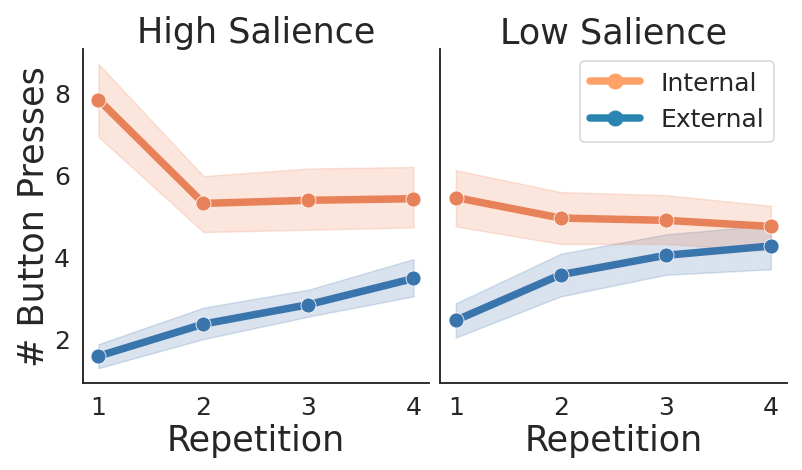

# metaawareness-and-default-states

This respository contains resources for the study: Meta-awareness, mind-wandering, and the control of ‘default’ external and internal orientations of attention


## Description

The “default mode” of cognition usually refers to an automatic tendency to simulate past, future, and hypothetical experiences, rather than attending to external events in the moment. “Mind wandering” usually refers to moments when attention drifts from external tasks to become engaged in internal, default-mode cognition. Both definitions are perhaps limited: the mind can be caught by external objects when attending internally, and objects in the external world can be just as captivating as internal thought, causing attention to drift. To explore the relationship between prepotent internal and external default modes and the bi-directionality of mind wandering, we measured brain activity in forty participants using fMRI during performance of a focused attention task. Naturalistic movie clips were presented four times in sequence. When subjects tried to focus attention on the videos, more mind wandering events occurred as the videos became less interesting with each repetition, and when less engaging videos were presented. When subjects focused internally on their own breath, more mind wandering events occurred when videos were most interesting (i.e. on the first repetition) and when more engaging videos were presented. In the whole-brain fMRI data and also in focused analyses of sensory areas and default mode areas, inter-subject correlation analysis revealed cortical signals of attention that corroborated the behavioral results. We suggest that whether the default state is internal or external, and whether the sources that disrupt it are internal or external, depend on context. 




## Navigation


### Analysis code:
- analysis code (`./code/analysis/`)

### fMRI prep preprocessing code
- preprocessing: (`/code/preprocessing`)

### fMRI Data
- fMRI data is available here: https://www.dropbox.com/sh/q51dsflo1riw9rf/AABcle7SHyfWi04KIAdcF-n-a?dl=0

### Getting Started
* Clone the Repo
* install environement dependencies
```
cd code
conda env create -f environment.yml
conda activate mei_project
```

* Download fMRI data via dropbox
```
cd data
wget https://www.dropbox.com/sh/q51dsflo1riw9rf/AABcle7SHyfWi04KIAdcF-n-a?dl=0
```


## Authors
Isaac R. Christian <br>
Samuel A. Nastase <br>
Lauren K. Kim  <br>
Michael S. A. Graziano
