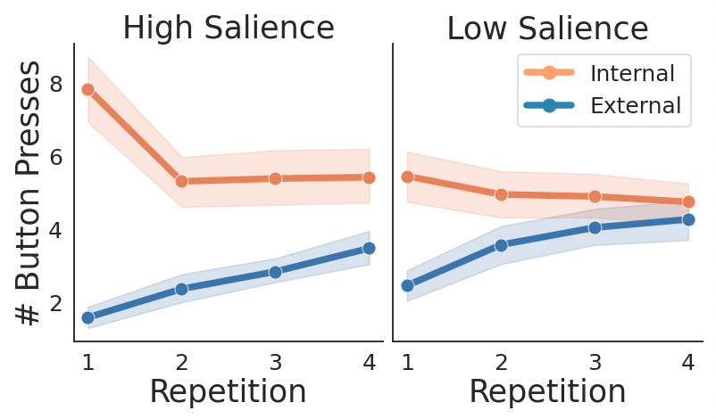

# metaawareness-and-default-states

This respository contains resources for the study: Meta-awareness, mind-wandering, and the control of ‘default’ external and internal orientations of attention


## Description

The “default mode” of cognition refers to an automatic tendency to simulate past, future, and hypothetical experiences, rather than attending to external events in the moment. “Mind-wandering” usually refers to moments when attention drifts from external tasks to become engaged in internal, default-mode cognition. But in some contexts, the mind can wander to external objects when trying to attend internally, and external focus can become captivating enough to act as the default mode. To explore the relationship between prepotent internal and external default modes and the bi-directionality of mind-wandering, we measured brain activity in forty participants using fMRI during performance of a focused attention task. Naturalistic movie clips were viewed, each one four times in sequence. When subjects were asked to focus attention on the videos, more mind-wandering events (distractions from the externally-focused task) occurred as the videos became less interesting with each repetition, and also when less engaging videos were presented. When subjects were asked to focus internally on breathing, more mind-wandering events (distractions from the internally-focused task) occurred when videos were most interesting (on the first repetition) and when more engaging videos were presented. In the fMRI data, inter-subject correlation, within-subject correlation, and GLM analyses found similar fronto-parietal networks engaged in transitions between default-controlled states regardless of the internal-external distinction, indicating more overlap in internal-external processing than previously assumed. We suggest that whether the default state is internal or external, and whether the sources that disrupt it are internal or external, depend on context.





## Navigation


### Analysis code:
- analysis code (`./code/analysis/`)

### fMRI prep preprocessing code
- preprocessing: (`/code/preprocessing`)

### fMRI Data
- fMRI data is available here: https://doi.org/10.34770/5kae-7k45

### Getting Started
* Clone the Repo
* Create conda environement from .yml file
```
cd code
conda env create -f environment.yml
conda activate mei_project
```

* Download fMRI data into /data (see above link)

* Start preprocessing fMRI data for ISC analysis
```
cd code/analysis
python slurm_create-data_preproc.py
```

## Authors
Isaac R. Christian <br>
Samuel A. Nastase <br>
Lauren K. Kim  <br>
Michael S. A. Graziano
